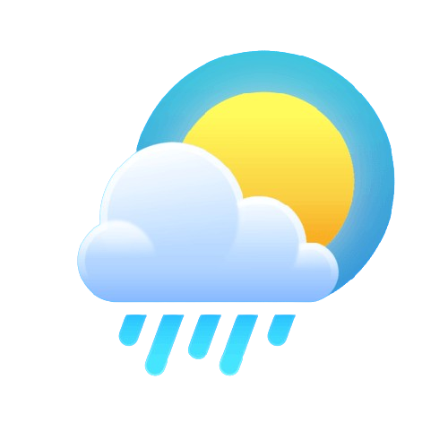
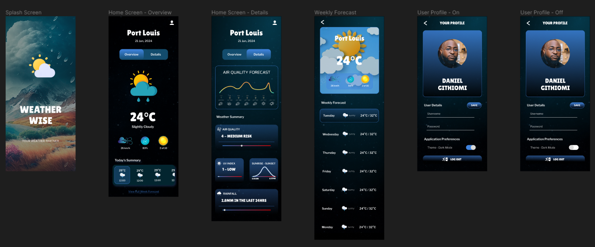

#  SKYESQUE

> Developed by <a href="http://github.com/githiomi">DANIEL GITHIOMI</a>

## Application Description

This is an Android Mobile Application Developed using Java. It is a university project for my Mobile
Platform Development course. The project incorporates as many learning material during the semester
as possible.

> Created By: Daniel Githiomi

## Preview

The following is a screenshot of the application design
on [figma](https://www.figma.com/file/pCHRFqbETynP7Qcs4WgSG4/Mobile-Platform-Design_Yr4Sem2_Coursework-Design?type=design&node-id=0-1&mode=design&t=UebFUjNWgQQPyBfi-0).

## Authentication

This application has been designed to be used as an internal application for Glasgow Caledonian
University (GCU) students and staff.

As such, it is required that to use the application, one must log in using their GCU credentials - _
_username__ and __password__

Valid login credentials:

| Username | Password  |
|----------|-----------|
| DGITH200 | daniel123 |
| GBOBB543 | bobby543  |
| ABART999 | allan321  |

## MINIMUM SYSTEM REQUIREMENTS

* API 24 and above
* 4GB RAM or Higher
* 16GB Internal storage or higher

## COMPATIBILITY

Compatible with all Android mobile phone that meet the __minimum API level 24__ requirement.

## TECHNOLOGIES USED

This portfolio was made entirely using Visual Studio Code using the following technologies:

* Java
* Lombok

## KNOWN BUGS

No bugs to report at the moment! the system works efficiently at 100% guaranteed.

__Slow internet connection can result in faulty rendering of animations__

## SETUP INSTRUCTIONS

* Git clone [this](https://www.github.com/skyesque) into your terminal.
* Open the folder in your favourite editor, for example Android Studio, using the following syntax.
* Set up a virtual device with __minimum API Level 24__
* Enjoy the __SKYESQUE__ application.
* Alternatively download and install the [.apk](skyesque.apk) file directly on your mobile device.

## SUPPORT AND CONTACT INFORMATION

Contact me through any of the following channels:

* Slack: danielgithiomi
* Email: <danielgithiomi@gmail.com>

## LICENSES

Click the following to access my license page: [Click-Here](https://githiomi.github.io/Privacy-Policy/)

> Copyright (c) {2024} DhosioLux.